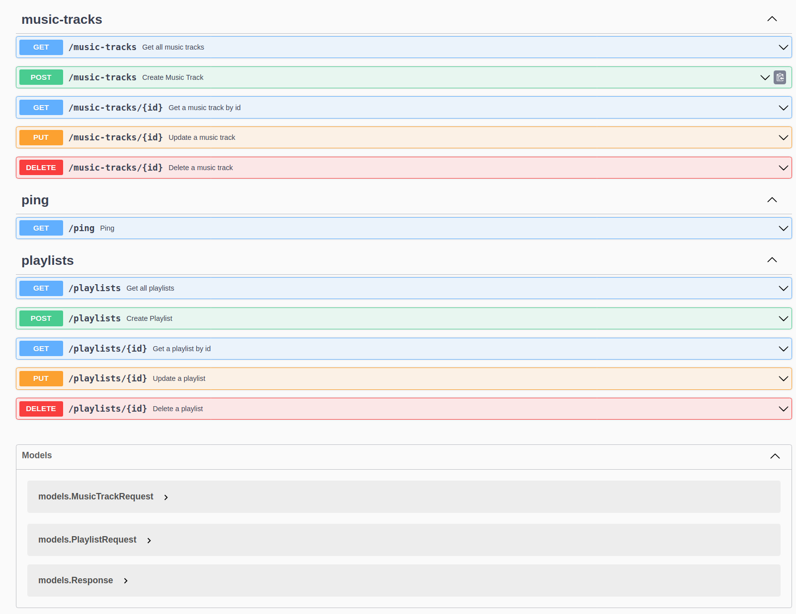

GoLang + MongoDB + Redis RESTful Application Starter
----------------------------------------------------
Hi everyone, this project is a 'Boilerplate to build RESTful
Applications  using
GoLang ([Gin](https://github.com/gin-gonic/gin) HTTP web framework), MongoDB.


Table of Contents
-----------------

- [Features](#features)
- [Prerequisites](#prerequisites)
- [Getting Started](#getting-started)
- [Project Structure](#project-structure)
- [Future Work](#future-work)

Features
--------

- [Gin](https://github.com/gin-gonic/gin)
- DotEnv with [Viper](https://github.com/spf13/viper)
- Request Validation with [Ozzo Validation](https://github.com/go-ozzo/ozzo-validation)
- MongoDB ODM ([mgm](https://github.com/Kamva/mgm))
- Docker support
- Swagger with [gin-swagger](https://github.com/swaggo/gin-swagger)

Prerequisites
-------------

- Git
- Docker
- [Go 1.22.2](https://go.dev/doc/install) and above


Getting Started
---------------

```bash
# Clone Project
git clone https://github.com/ebubekiryigit/golang-mongodb-rest-api-starter.git go-rest-api-starter

# Change Directory
cd go-rest-api-starter
```

#### Using Docker

```bash
# Build & Create Docker Containers
docker-compose up -d
```

#### Using Local Environment

```bash
# Copy Example Env file: cp ./.env.example .env
# Change Server Port
make run
```

The application starts at port 8080:

- `GET /v1/ping` Health check endpoint, returns 'pong' message

---

- `POST /v1/music-tracks` Create a new music track
- `GET /v1/music-tracks` Get paginated list of music tracks
- `GET /v1/music-tracks/:id` Get a one music track details
- `PUT /v1/music-tracks/:id` Update a music track
- `DELETE /v1/music-tracks/:id` Delete a music track

---

- `POST /v1/playlists` Create a new playlist
- `GET /v1/playlists` Get paginated list of playlists
- `GET /v1/playlists/:id` Get a one playlist details
- `PUT /v1/playlists/:id` Update a playlist
- `DELETE /v1/playlists/:id` Delete a playlist
---

- `GET /swagger/*` Auto created swagger endpoint

You can also see: http://localhost:8080/swagger/index.html



> If you want to add new routes and swagger docs, you should run ```swag init```
> See: [Gin Swagger](https://github.com/swaggo/gin-swagger)

Project Structure
-----------------

```
├── controllers         # contains api functions and main business logic
├── docs                # swagger files 
├── models              
│   └── db              # collection models
├── routes              # router initialization
├── validators          # data/request validators
├── utils                # func common
└── services            # general service & database actions
```

Future Work
-----------

- Redis
- Microservice
- Message Queue
- Logs

License
-------

[MIT License](LICENSE) - [Maverick](https://github.com/nhanlt1602)